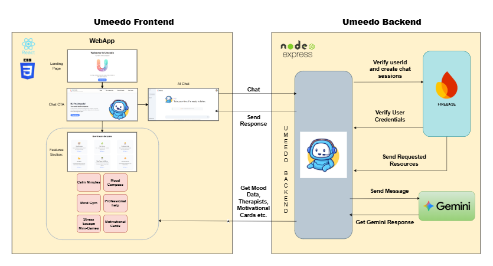

# Umeedo AI – Generative AI for Youth Mental Wellness

  
*Your mental wellness companion – A confidential, empathetic AI for youth mental health.*  

[](https://genaihackathon.withgoogle.com)

---

## Table of Contents
1. Overview  
2. Problem Statement  
3. Solution  
4. Features  
5. Tech Stack  
6. Project Structure  
7. Project Architecture  
8. Getting Started  
9. Chat Feature Screenshots  
10. Author / Contact  

---

## Overview

Umeedo is a web-based AI-powered mental wellness companion designed for Indian youth.  
Developed for the Google GenAI Exchange Hackathon 2025, Umeedo provides a safe, confidential space for emotional expression, mood tracking, and mental health guidance.

**MVP Features:**  
- Chat with Umeedo, an AI companion  
- Log and track moods using Mood Compass  
- Access Privacy, Terms, and Contact pages  

**MVP Limitation:** Currently, only the “Chat with Me” and “Mood Compass” features are available.


---

## Problem Statement

Mental health remains a societal taboo in India, creating barriers for young adults and students. Key challenges include:  
- Limited confidential outlets for mental health concerns  
- High cost and limited accessibility of professional help  
- Social stigma associated with seeking mental health support  

**Objective:** Provide accessible, culturally sensitive, and impactful mental wellness solutions for youth using generative AI.

---

## Solution

Umeedo leverages Google Cloud's Generative AI to:  
- Provide empathetic conversations and emotional support  
- Track moods and emotional trends with Mood Compass  
- Offer guided exercises for relaxation and mindfulness  
- Facilitate access to licensed therapists (future implementation)  

It acts as a confidential companion to help users pause, reflect, and improve emotional well-being.

---

## Features

| Feature | Description | Status |
|---------|-------------|--------|
| Chat with Me | Conversational AI for mental wellness support | Available |
| Mood Compass | Log feelings and track emotional journey | Available |
| Calm Minutes | Short exercises to relax mind | Coming Soon |
| Mind Gym | Exercises to boost focus and reduce stress | Coming Soon |
| Stress Escape Mini-Games | Interactive mini-games for stress relief | Coming Soon |
| Motivation Cards | Inspiring messages to lift mood | Coming Soon |

---

## Tech Stack

| Layer | Technology |
|-------|-----------|
| Frontend | React, React Router, Lottie, Recharts |
| Backend | Node.js, Express, Firebase, Google Cloud |
| Build & Deployment | Vite, Vercel |

---

## Project Structure


```
UMEEDO-AI
│
├─ client/               # Frontend
│  ├─ public/            # Public assets (favicon, redirects)
│  ├─ src/
│  │  ├─ assets/         # Images, icons, animations
│  │  ├─ components/     # React components (ChatWindow, Hero, Sidebar, etc.)
│  │  ├─ context/        # React Context (ChatContext)
│  │  ├─ firebase/       # Firebase config & initialization
│  │  └─ pages/          # Page components (Landing, Chat, MoodTracker, Privacy, Terms, Contact)
│  ├─ package.json
│  └─ vite.config.js
│
├─ server/               # Backend
│  ├─ config/            # Gemini / AI configs
│  ├─ index.js           # Express server entry
│  ├─ package.json
│  └─ .env               # Environment variables
```

---

## Project Architecture 


## Getting Started

### Prerequisites
- Node.js ≥ 20  
- npm / yarn  

### Setup Frontend
```bash
cd client
npm install
npm run dev
```

### Setup Backend
```bash
cd server
npm install
npm run dev
```

> Open the frontend at `http://localhost:5173` and backend at your configured port.  

---

## Chat Feature Screenshots

### Chat Call-To-Action (CTA)


### Chat Window


### Example AI Response


---

## Author & Contact

**Abdullah Ansari** – Developer of Umeedo AI  
[LinkedIn](https://www.linkedin.com/in/abdullahlko) | [GitHub](https://github.com/abdullahlko)

